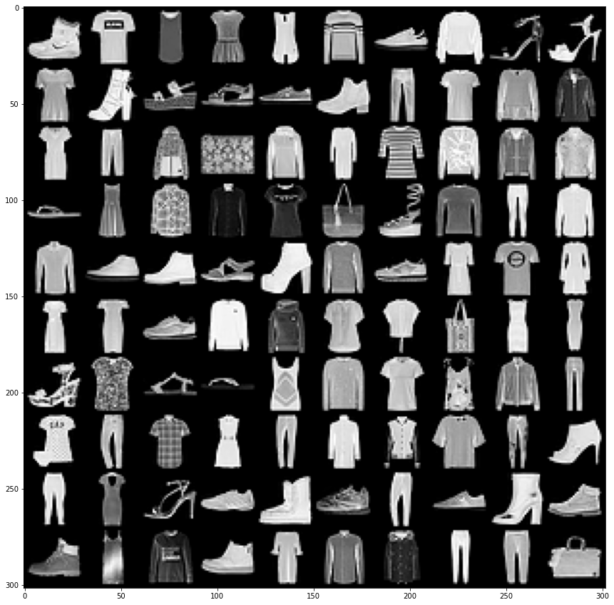

## Fashion MNIST - Web app
This repository is web API for Images classfication of fashion mnist dataset with implementation (Training and app files)<br /> 

## Dataset Sample
<p align="center">
  
</p>
<br />
Here CNN is trained locally with k-fold cross validation and saved into <em>/models</em>. To demonstrate, we used test images to test the prediction from test/test_images using web API. To predict the class of the image on web server we used Flask, Heroku, Pytorch and gunicon.<br />


## Files
* Model training file: <em>models/Train_Fashion MNIST.ipynb</em>
* App files: <em>app/</em>
* Requirements: <em>requirements.txt</em>
* Training data: <em>data/FashionMNIST/FashionMNIST</em>
* Run files: <em>test/</em>

## Execution
clone <em>fmnist-app/test/</em>
```console
git clone https://github.com/rishabh06sharma/fmnist-app.git
```


```console
cd fmnist-app/test
```
```console
python run.py
```

All Set!!

